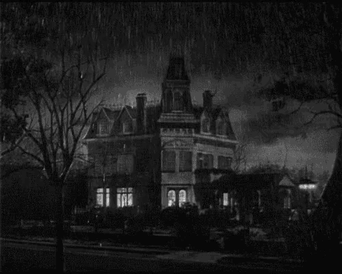

# Mystic Manor



*A scene-based haunted-house adventure built with **HTML + CSS** and just a sprinkle of JavaScript to drive choices and pass simple state via the URL.*

**Play:** [https://scalemailted.github.io/MysticManor/](https://scalemailted.github.io/MysticManor/)

**Code:** [https://github.com/scalemailted/MysticManor](https://github.com/scalemailted/MysticManor)

---

## What is it?

**Mystic Manor** is a lightweight, file-per-scene interactive story. You prowl a cursed estate, collect a few key items, and choose how the haunting ends. Links between pages preserve flags like “do you have the knife?” or “is the hatch open?” using query-string parameters, no backend or build step required.

---

## Design philosophy

* **Minimal JavaScript:** tiny, page-local scripts for choice handling and URL param reads/writes.
* **Framework-free:** plain HTML/CSS/JS keeps everything inspectable and classroom-friendly.
* **Simple, inspectable state:** flags live in the URL (e.g., `?sk=0&mc=1&kn=0&nl=0&open=1`) and flow through links.
* **Deterministic endings:** certain items/flags unlock custom finales in the Study.

---

## Quick start

1. **Begin** at the **Welcome** screen and click **Proceed** (this seeds the URL flags).
2. **Explore the yard** → **Backyard**. From there you can reach the **Shed** (machete), the **Trapdoor** (to the basement), or return to the front.
3. **Enter the manor** and choose rooms; some actions escalate danger and funnel you upstairs.
4. **Reach the Study** to resolve the mystery—your items determine the ending you see.

---

## How it works (under the hood)

* **State in the URL:** Pages read/write flags like `sk`, `mc`, `kn`, `nl`, and `open` via `URLSearchParams`, then propagate them by appending `location.search` to links.
* **Click-to-act scenes:** Buttons/links either change text/image on the page or “lock in” a result and navigate.
* **Gated paths:** e.g., cut vines on the **Trapdoor** with the machete, then enter the **Basement** to search shelves; the **Backdoor** is inspectable but won’t accept the silver key.

---

## State & items (flags)

* `sk` – **Silver key** (opens the **Front Door**; obtained in the **Basement** shelves).
* `mc` – **Machete** from the **Shed** (lets you clear the basement vines).
* `kn` – **Knife** from the **Dining Room** (unlocks a Study ending).
* `nl` – **Necklace/Amulet** from the **Living Room** (unlocks a different Study ending).
* `open` – **Escalation flag**; when set, some ground-floor choices are hidden and the game urges you upstairs.

---

## File map (scenes)

* `welcome.html` – Landing page with **Proceed** button that seeds all flags (start here).
* `manor.html` – **Front yard** hub → **Front Door** or **Backyard**.
* `frontdoor.html` – **Porch**; door opens only if `sk > 0`. Optional risky window attempt = early exit.
* `backyard.html` – **Overgrown yard** hub → **Trapdoor**, **Shed**, **Backdoor**, or return to **Front yard**.&#x20;
* `backdoor.html` – Inspect the **back door** (locked; the silver key does **not** work here).&#x20;
* `shed.html` – Find **machete** (`mc=1`), collapse the shed, and reflect that state on revisits.
* `trapdoor.html` – **Basement hatch**; cut vines with **machete** and proceed once opened.
* `basement.html` – Search shelves to obtain the **silver key** (`sk=1`); revisits hide the shelf option.&#x20;
* `mainhall.html` – **Opening hall**; routes to **Living Room**, **Dining Room**, or **Upstairs**; hides options if `open > 0`.
* `diningroom.html` – Grab the **knife** (`kn=1`) or perish investigating the plate display.
* `livingroom.html` – Inspect **fireplace**/**bookshelf** to obtain the **amulet** (`nl=1`) and escalate danger.
* `hallway.html` – **Upstairs hallway**; go to **Study** or faint (Ending + restart).
* `study.html` – **Finale**; text varies if you hold the **knife**, **amulet**, or other flags. Includes **Restart** link.


---

## Repo layout

```
docs/            # screenshots, promo image (e.g., docs/mystic_manor.png)
game/            # scene HTML, assets/, styles/, scripts/
index.html       # optional redirect/landing -> /game/welcome.html
readme.md
```

---